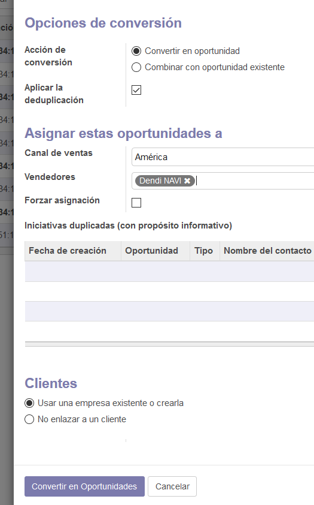

# Lab. 3: CRM en ODOO

## Desarrollo

2.2. Visualizamos a Aplicación que vamos a instalar la cual es CRM.

2.3 Vemos que se agrego y el espacio en la cual podemos acceder al CRM.

2.4 Vemos el panel que nos aparece al momento de elegir la opción de CRM.

3.2 La vista de "Bienvenido".

3.3 Vista de "Sus Expectativas", llenado como se indica.

3.4 Vista de "Sus KPIs", llenado como se indica.

3.5 Vista de "Oportunidades", llenado como se indica.

3.16 Vista final con sus llenados respectivos.

4.3 Cartilla para agregar una nueva compañia.

4.5 Creación de contactos.

4.10 Vista de la compañia creada en el CRM.

5.9 Canal de ventas con sus repectivos miembros de equipo.

5.10 Colocación del lidel del canal en canal de ventas.

5.12 Vista de punto de "ventas directas" creada con éxito.

6.2.1 Vista del Panel de CRM en ajustes.

6.2.5 Llenado de datos para crear una iniciativa.

6.2.6 Resultado final de como se ve una iniciativa con los datos.

6.2.9 Visión sobre el miembro "Dendi NAVI" perteneciente a la compañia ACME.

6.3.4 Creación de la compañia SCANIA S.A.

6.3.4.2 Creación de contacto para la compañia SCANIA.

6.3.7 Resultado del plan creado.

6.3.7.5 Vista de la parte Web creada siguiendo el laboratorio.

6.3.7.10 Parte de "Contáctenos" con los datos llenados.

6.3.7.12 Vista del resultado del nuevo plan.

6.3.7.15 Vista del resultado en el cual se añadio un personal a la cartilla.

6.3.7.16 Vista de la parte "Calificado" y las correspondientes plantillas.

6.3.7.17.1 Creación de otro usuario en Contáctenos.

6.3.7.17.2 Creación de otro usuario en Contáctenos.

6.3.7.17.3 Vista de la creación exitosa de los dos usuarios creados.

6.3.7.17.4 Vista de la conversión a oportunidades.

6.3.7.17.5 Vista de la conversión a oportunidades.

6.3.7.17.6 Vista del resultado de los usuarios creados con las oportunidades en sus cartillas.

6.3.7.17.7 Usuario movidos hacia la lista de "Calificado" junto con las otras cartillas.

## Tarea

1 Primero vamos a dirigirnos hacia Ventas en el cual vamos a seleccionar la opción "Clientes", luego para organizarnos mejor colocamos la forma de vista llamada "Lista". Teniendo estos puntos hechos podemos visualizar los clientes que se tienen actualmente, luego vamos a seleccionar cualquiera de ellos y le seleccionamos la casilla de la parte izquierda para poder ir al boton "Acción" ubicado en la parte superior al costado de imprimir, como se ve en la imágen.

1.1 36 Primer paso para la exportacion es indicar la accion que se realizara a dicho cliente seleccionado.

Luego seleccionamos la opción exportar y nos mandará a un nuevo cuadro de selección, en el cual seleccionaremos los siguientes campos: Nombre y Empleado. Finalmente le damos a añadir cada uno y seleccionamos la opción Excel para luego exportarlos.

1.2 37 Elegir las opciones a exportar.

Luego vamos a abrir el archivo .xls que exportamos y descargamos para luego visualizar los campos y agregamos nuevos.

1.3 38 Vista de la exportación en Excel.

Llegado a este punto debemos guardar el nuevo archivo .xls para poder importarlo hacia nuestro ODOO. En "CLientes" le damos a la opción importar y cargamos el archivo con los nuevos datos. Nos mostrará el contenido de este para que luego le demos en importar y los agrege.

1.4 39 Vista de la importación y los campos a llenar.

1.5 40 Vista del resultado de los usuarios creados y/o añadidos.

2.1 34 Primera vista de la parte Web.

2.2 35 Segunda vista de la parte web.

## CONCLUSIONES

## - Vamos a trabajar este laboratorio con la aplicación llamada CRM la cual se indentifica con una imágen de dos manos estrechandose como un saludo entre ellas.

## - Vamos a acceder a la barra de progreso ubicada en la parte superior derecha para introducir datos de configuración de módulo para tambien poder visualizar diferentes puntos a tomar en cuenta a lo largo del desarrollo del laboratorio y del trabajo a desarrollar.

## - En el Tablero de Cliente de CRM podremos ver los clientes que por defecto ya se nos crea así como los que vayamos ir creando con sus respectivos datos.

## - Cada compañia creada debe contar con miembros de equipo de ventas los cuales serán creados de manera sencilla así como tambien los podemos crear en el contáctenos

## - Con bootswatch vamos a poder crear vista y funcionalidad de una página web así como podemos diseñarla a nuestro gusto con las herramientas que se nos da.
