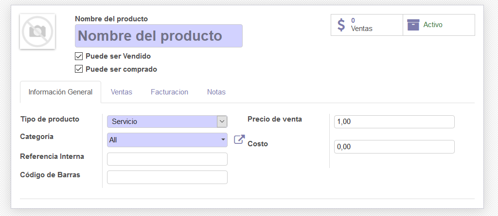
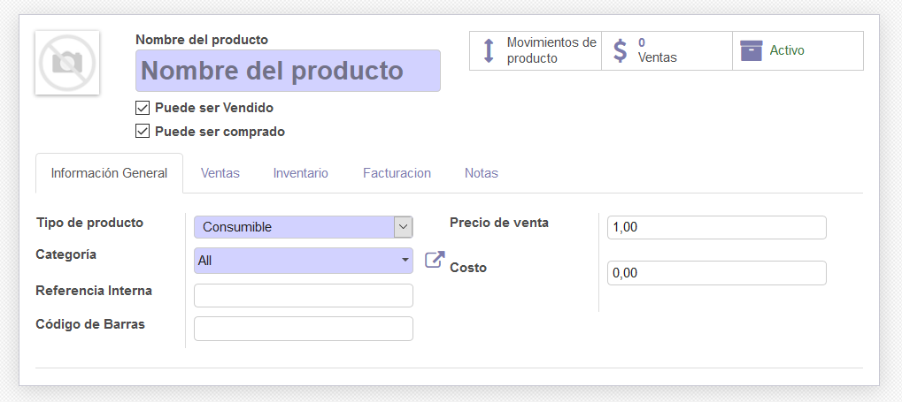
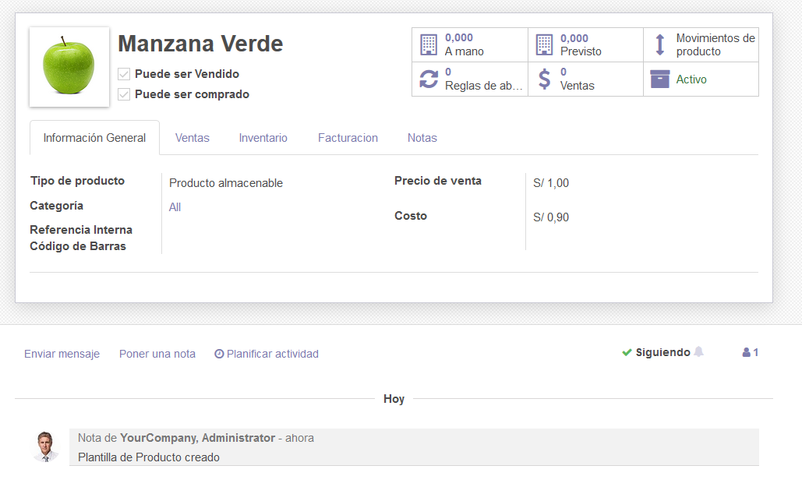
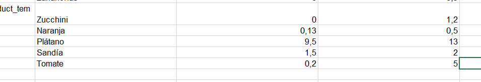

# Lab. 4: Módulo Logístico

## Desarrollo

1.2. Vista del tablero de Inventario.

2.4 Colocación del check en "multialmacén".

2.11 Vista del resultado de la creación de "Almacen Los Incas".

2.6 Creación del almacen secundario.

3.4 Vista de la opción de "Rutas multietapa"

4.2 Vista de la creación del producto sin completar en Tipo "Producto almacenable".

4.3 Vista de la creación del producto sin completar en Tipo "Servicio".

4.4 Vista de la creación del producto sin completar en Tipo "Consumible".

4.6 Vista del producto "Manzana verde" ya creado.

4.8 Vista de los stock por almacén de manzana verde.

5.6 Vista de los espacio a añadir los productos con sus precios.

5.8 Vista de la importación de los productos nuevos.

6.5 Vista de los Stock al campo de Cantidad real.

6.7 Vista del producto con sus cantidades a mano.

7.2 Vista Vista de la transferencia a realizar.

7.4 Vista de info adicional para la creación de una transferencia.

7.3 Vista de operaciones en la transferencia.

## Tarea

- Se va a ver que al activar Atributos y variantes se nos va a habilitar la opción de unidad de medida en los productos, a estos se le va a poner una unidad de medida como tenemos el ejemplo de "docena". Para cuando activemos Unidades de medida vamos a ver que se habilita la opción de Unidad de medida de compra con la cual vamos a indicar en que medida de compra estará el producto como por ejemplo en gramos "g".

  9.1 Vista de "unidad de medida" y "unidad de medida de compra".
  

- Vamos a usar reglas de abastecimiento cuando el stock posea cantidades existentes de un producto para darles un stock mínimo que pueda poseer como un stock máximo, Odoo se va a encarga de crear automáticamente órdenes de fabricación de borrador. Por último vamos a usar estar reglas cuando los productos sean en cantidades mayores y soliciten una cantidad estricta o que sea promedio de la cantidad solicitada.

  9.2 Vista de la creación de una regla de abastecimiento.
  

## CONCLUSIONES

- Albaran es el documeto legal para el envio de productos en cantidades mayores.
- Vamos a habiliatar la opción multialmacén para poder crear varios almacenes como el almacén secundario en el cual le vamos a introducir productos con los cuales se desarrollara las acciones que pide el laboratorio como las transferencias.
- Podemos crear productos con los cuales vamos a introducirles tanto datos de costos como tambien le podemos colocar unidades de medida y de medida de compra, entre otros como añadir sus cantidades y ver los movimientos que tienen.
- Podemos introducir productos tanto mediante el Odoo o simplemente exportarmos los productos y los agregamos desde el Excel de manera mas rápida y sencilla agregándole los valores necesarios.
- Con las reglas de abastecimiento vamos a poder añadir un mínimo y un máximo que puede almacenar un stock con un producto en específico.
