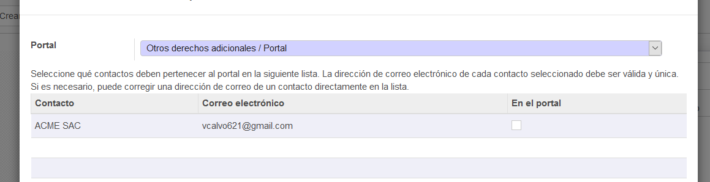

# Lab. 5: Módulo Ventas

## Desarrollo

2.1. Vista de los productos a añadir.

2.4 Mensaje por si no hay suficiente inventario.

2.3 Lista de pedidos con impuestos añadidos.

2.5 Vista de como se completa con los espacios llenos y observación.

2.8 Vista de la entrega para el correo.

3.5 Vista de la factura o boleta a enviar.

4.3 Vista de la validación de la factura.

4.4 Reenvio de la factura por medio del correo.

4.6 Vista del pago a registrar.

5.2 Observación del acceso para aplicaciones poco seguras.

5.3 Vista de información de seguridad con el correo a enviar.

6.3 Vista final sobre las opciones que se tomaron, es editable.

7.1 Aplicación sobre la primera opción de múltiples precios de venta por producto.

7.2 Vista del producto a tomar en la venta.

7.5 Aplicación sobre la segunda opción de múltiples precios de venta por producto.

8.3 Vista del portal por el cual nos muestra el contacto y el correo perteneciente a este.

## OBSERVACIONES

- Vamos a trabajar sobre una nueva base de datos, pero teniendo en cuenta que agregaremos un producto aunque sea para continuar sin problemas, pero es mejor seguir bajo la base de datos del anterior laboratorio.
- En este laboratorio vamos a poder ver las cotizaciones del cliente, así como los métodos para que los pueda ver.
- Tenemos que crear una cuenta nueva de Gmail, ya que la que se tiene no acepta la opción para permitir acceso a aplicaciones poco seguras.
- Las facturas a generar ya son predeterminadas y solo están obteniendo datos según el producto y sus precios y/o costo de la venta final.
- Siempre debemos darnos cuenta de que tenemos que validar las cotizaciones así como las ventas también las debemos confirmar porque se nos puede pasar eso y luego no va a contabilizarlas.

## CONCLUSIONES

- Nos vamos a dar cuenta que, al momento de enviarle la factura por Gmail, la cuenta debe estar vinculada con la opción de acceso a aplicaciones poco seguras.
- Vamos a ver que por la primera vez que vayamos a enviar una factura por Gmail, esta nos pedirá que elijamos una plantilla para la impresión.
- Tenemos 4 tipos de orden de facturas las cuales son Líneas de factura, Líneas a facturar, Adelanto de pago y Pago anticipado. De las cuales vamos a utilizar la segunda.
- Vamos a darnos cuenta de que al momento de realizar una validación de factura esta nos va a indicar que la empresa que lo emitió ha hecho una venta y así sucesivamente en su perfil de empresa.
- Un punto importante es que la cuenta de Gmail este con la opción acceso de aplicaciones poco seguras habilitada.
