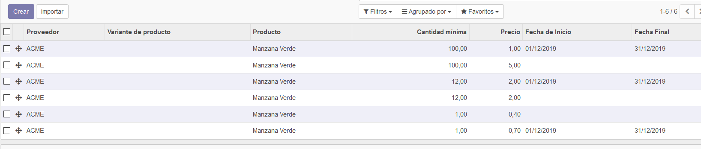
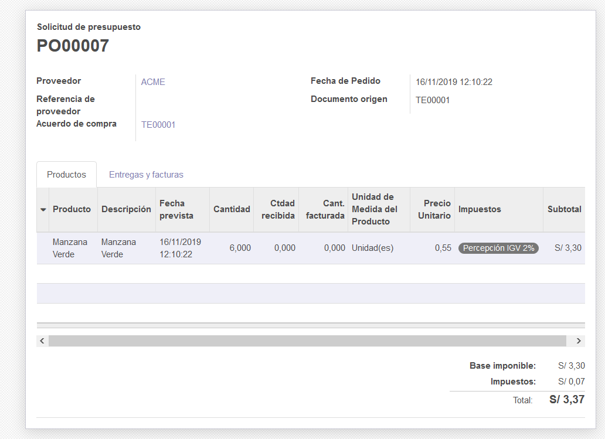

# Lab. 6: Módulo Compras

## Desarrollo

2.2. Vista de una solicitud de presupuesto, con datos básicos

2.3. Vista de la editación del idioma.

2.4. Vista de la habilitación de Imprimir y enviar por correo electrónico.

2.6. Vista de la validación de solicitud de presupuesto con las nuevas opciones habilitadas.

3.2. Vista del mensaje al hacer la transferencia.

4.3. Vista de la orden de compra.

4.1. Vista de la factura borrador.

4.3. Vista del proveedor con las compras realizadas.

4.3. Creación de una nueva cuenta bancaria.

4.3. Vista del formulario de detalle del proveedor.

4.4. Vista de la factura pagada, también vemos que el saldo es exacto ya que nos da S/.0.00 de resultado.

5.1. Vista de la ficha de detalle del producto adquirido.

5.3. Vista de la habilitación del menú Tarifas de Compra, donde veremos los proveedores, el producto, las cantidades como precio y el precio final.

6.1. Vista de la opción Aprobación de pedido y el aporte de su importe mínimo.

6.5. Vista de la creación del producto Manzana Verde.

6.5. Vista de la creación finalizada con los espacios llenos del producto Manzana Verde.

6.5. Vista de la solicitud de presupuesto con los proveedores llenos.
[odoo17](imagenes/Imagen17.PNG)

6.7. Vista de la validación del ganador del proceso.

7.2. Vista del módulo Top Buying Products.

7.8. Vista de la opción de Top Buying Product.

## Conclusiones

## - Vamos a ver que se pueden alterar los idiomas para realizar un mejor entendimiento y evitar el cambio de moneda para las transacciones que se realizaran.

## - Las órdenes de compra pueden variar entre diferentes empresas, teniendo en cuenta siempre el stick principal de dicho producto. Así como también se va a poder ordenar más de 1 producto.

## - Vamos a necesitar crear una cuenta bancaria, con la cual vamos a proceder con el laboratorio y la paga de los productos.

## - Podemos ver todos los productos que se venden con sus precios y cantidades dependiendo del proveedor que lo está realizando, estos se pueden repetir.

## - Vamos a ver que Odoo, va a tener diferentes Apps para agregar y la mayoría son de paga, pero con Top Buying Products, el cual es gratis; vamos a poder crear un reporte de los productos más vendidos durante un cierto periodo.
