# Lab. 7: Módulo punto de Venta

## Desarrollo

2.3 Vista de la creación de un usuario nuevo.
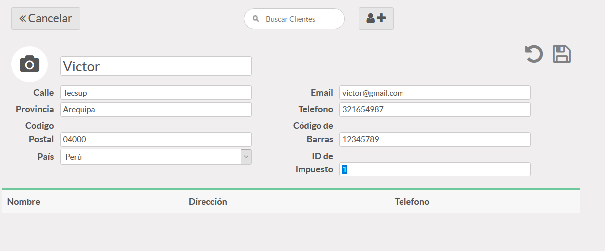

2.4 Vista de la primera paga por efectivo.
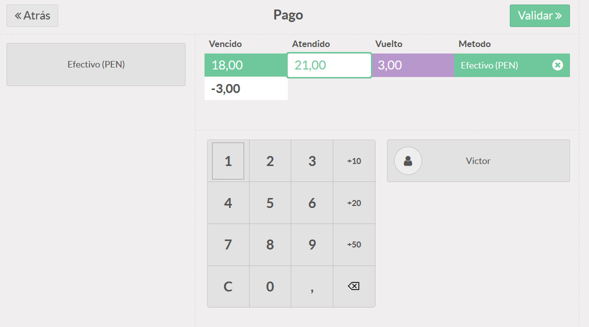

2.5 Vista de la opción para imprimir la boleta.
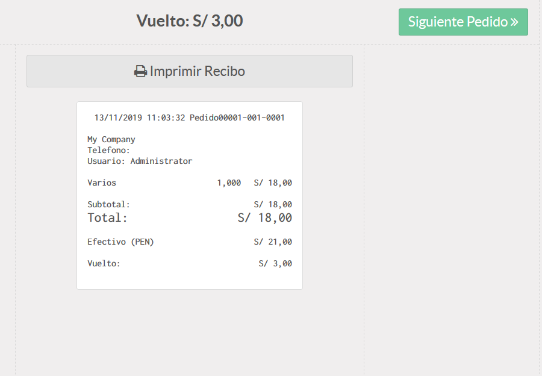

2.6 Vista de la "sesion" con el primer resumen.
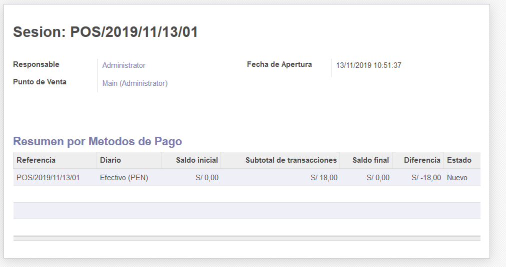

3.3 Vista del control de efectivo con sus cambios respectivos.
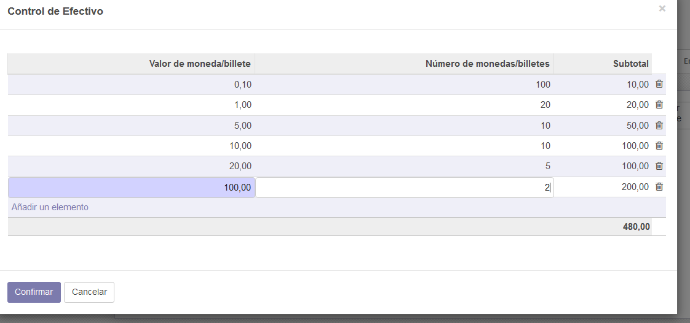

3.4 Vista de la paga por efectivo, visa y mastercard.
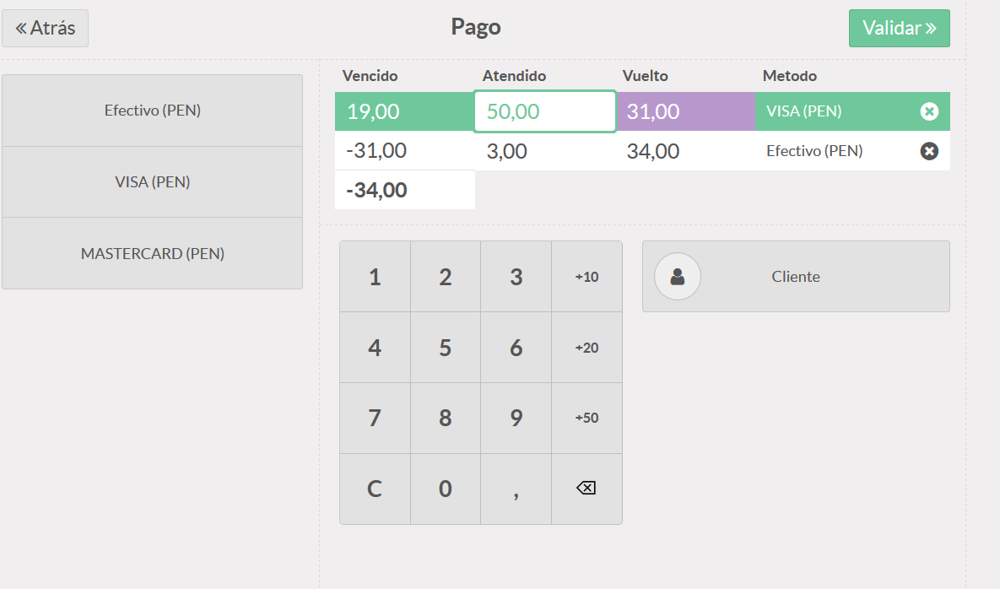

3.5 Vista de creación de usuario Cajero.
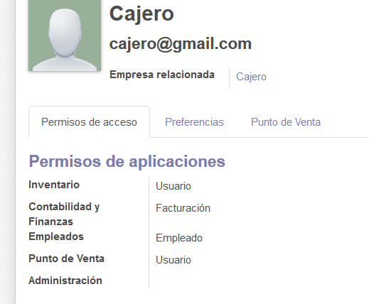

3.8 Vista de la colocación de la contraseña para ingresar como administrador.
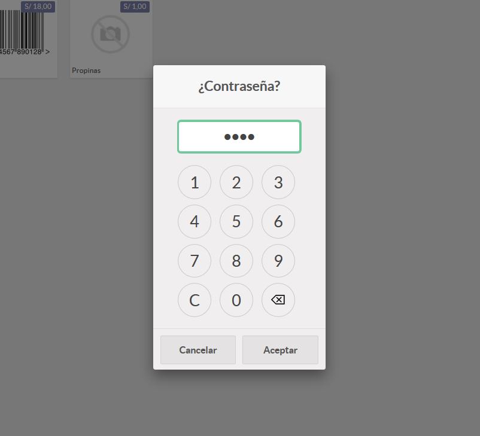

4.4 Vista de los productos con su tipo como manzana o propinas.
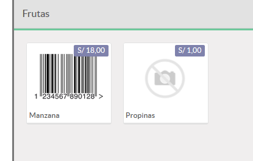

5.5 Vista del ingreso por Administrador y la sala en que esta.
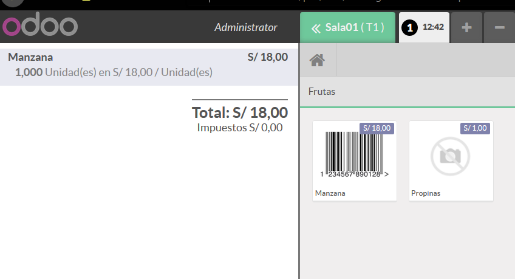

5.9 Vista de las opciones a tomar como Nota, Transferir, Clientes, Recibo y Dividir.
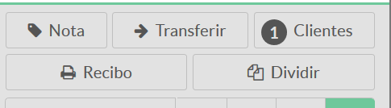

## CONCLUSIONES

## - Vamos a utilizar el módulo punto de venta, con el cual podremos ver que tiene una interfaz en la cual nos ubicaremos con los productos y también una parte para comprar los productos como un cajero.

## - Vamos a utilizar la opción de Control de precios para poder restringir la modificación de los precios a los responsables y evitar problemas.

## - Vamos a crear bancos para poder interactuar con la venta de tarjeta con Visa y Mastercard.

## - Vamos a ver que tenemos la opción para dos tipos de pago ya sea por efectivo o por tarjeta a la vez que podemos pagarlas en los 2 tipos a la vez, teniendo en cuenta en la factura nos sale si pagamos en efectivo y/o tarjeta.

## - Nosotros utilizaremos los tipos de clientes para diferenciarlos ya que con los administradores podemos hacer más cosas y para esa diferencia, tenemos que introducirle una contraseña la cual puede ser de 4 digitos y para cuando queramos ingresar, nos solicitará esta.
